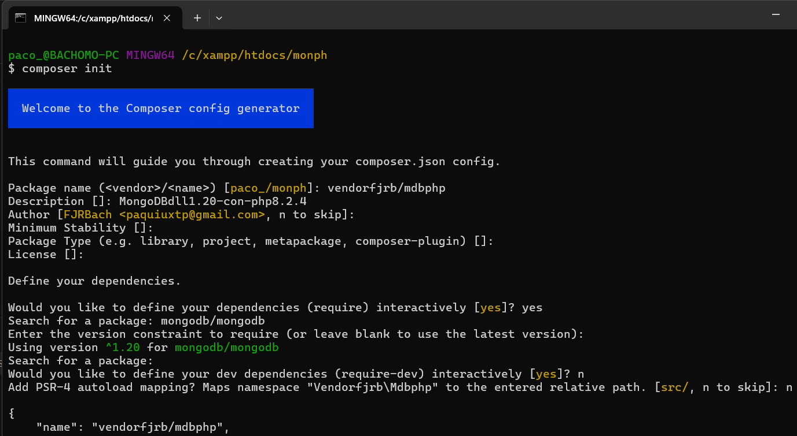
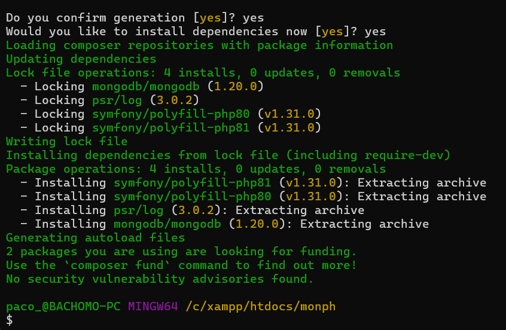
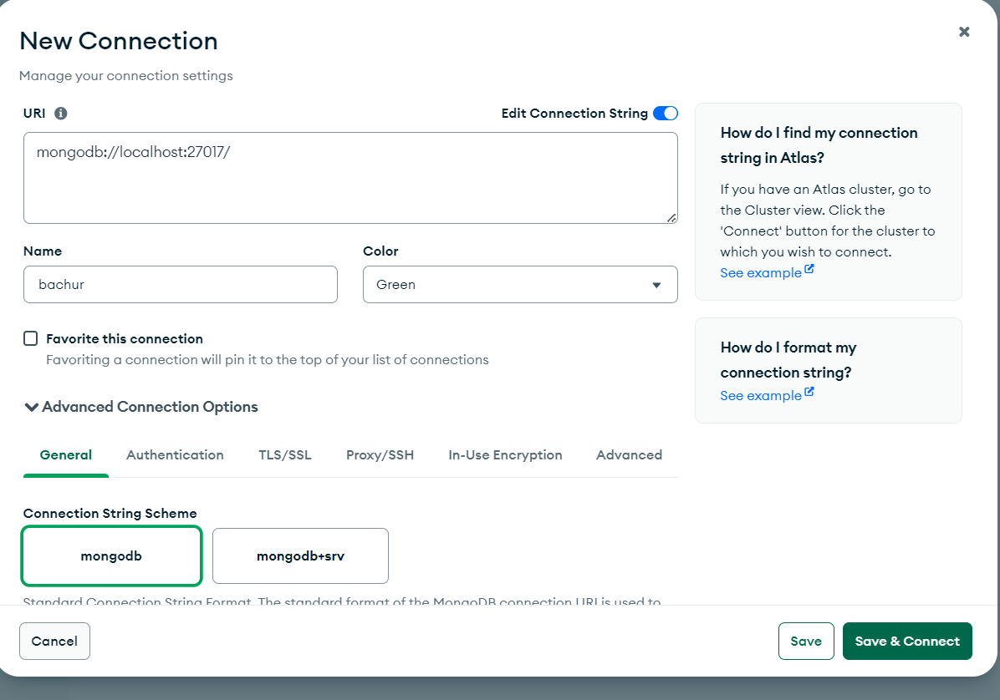
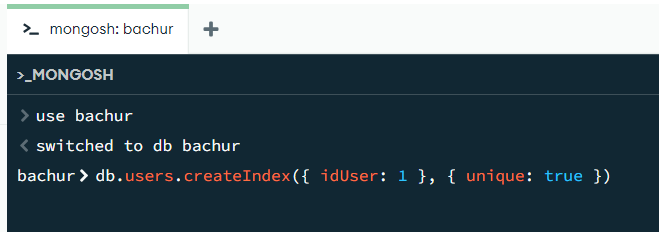

# Práctica de crear, listar y modificar datos en MongoDB con PHP #
## Se requirió de: 
- php version 8.2.4 
- composer version 2.7.1
- mongoDB version 8.0.1
- mongoDB 1.20.0 dll
#
# En el directorio de C:\xampp\php\ext #
## Habilitamos (en el directorio del php): extension=php_mongodb.dll ##
## en esta práctica fue ' C:\xampp\php\php.ini ' ##
### Se encuentra (8.2 Thread Safe (TS) x64) para descargar en: https://pecl.php.net/package/mongodb/1.20.0/windows ###
### Para poder cargar correctamente la extensión que ocupa php para mongoDB ###

### La configuración usada para composer en esta práctica fue:
```json
{
    "name": "vendorfjrb/mdbphp",
    "description": "MongoDBdll1.20-con-php8.2.4",
    "require": {
        "mongodb/mongodb": "^1.20"
    },
    "authors": [
        {
            "name": "FJRBach",
            "email": "paquiuxtp@gmail.com"
        }
    ]
}
```
### Para construir se debe ejecutar el siguiente comando en la terminal: ###
```bash 
composer init 
```
### El ejemplo de configuración se muestra en:

### Se confirma la generación e instalación ### 

## Opcional ##
### Se puede escanear el puerto de escucha que utiliza mongoDB para confirmar que está escuchando y podrá ejecutarse sin ese problema la aplicación ###
```bash 
nmap -p 27017 localhost
```
### O usar para cmd nativo ###
```bash 
netstat -a -n -o | findstr :27017
```
# En caso de no tener iniciado mongo y que mongod no mantenga la ejecución del servidor (servicio) #
## NonExistentePath: Data directory C:\data\db not found. Create the missing directory or specify another path using... ##
### Se debe verificar que exista una carpeta *data* en C:\ ### 
### De modo que exista el directorio C:\data\db y después se podrá ejecutar 'mongod' (manteniendo en ejecución). ###
#
# Utilizando la GUI de MongoDB-Compass # 
### Primero creamos la conexión y después utilizando el Shell de MongoDB, creamos una base de datos llamada bachur ###



# Al tener los pasos anteriores, tendremos las dependencias y base de datos requerida para la práctica a realizar con el código de php #
